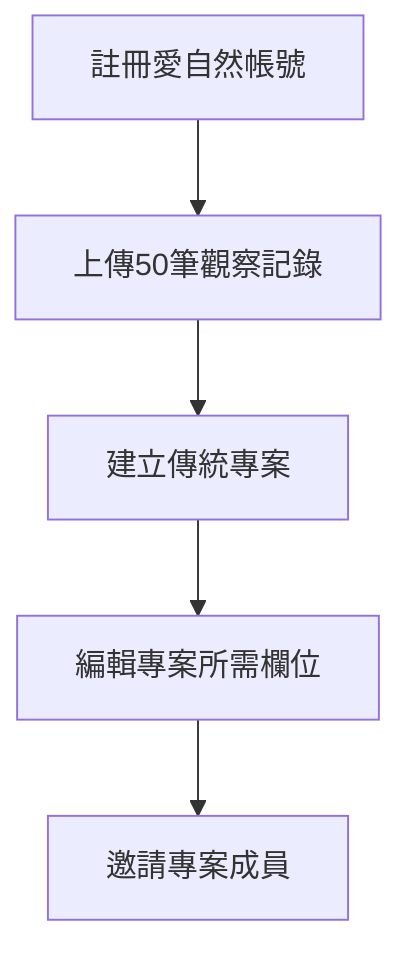

# 一、地方主管機關創立傳統專案
###### tags: `inaturalist` `生態給付` `生態給付說明書`

[TOC]

地方主管機關需創建具有傳統專案權限之帳戶，整體操作流程如下

### 1、註冊愛自然帳號
請見上述[教學](/_wcnc1AnSuiCsNq5evIrgA)

### 2、上傳50筆觀察記錄
由於愛自然創立傳統專案的權限僅開放給上傳50筆觀察紀錄之帳號，為了得到權限，本團隊建議承辦人員先將過往(e.g. 110年度)尚未上傳之觀察照片先上傳50筆觀察記錄到愛自然，並正確填寫資訊，之後再將這50筆紀錄納入專案。

**注意:就算是為了開啟權限，也請不要重複上傳一樣的觀察紀錄喔**

### 3、創立專案

點擊右上角帳號資料，下拉式清單選專案->開始一個專案
:::success

:::

點選後會有收藏專案、綜合專案、傳統專案的選項，請點擊下方傳統專案之連結
:::success

:::

依序填寫專案資訊，建議專案標題須包含縣市及年度資訊，專案類型選擇**一般**，優先成員模組勾選**僅限邀請**，優先提交模組選擇**任一**，描述及條款可依需求填寫
:::success

:::

地理位置建議直接到iNaturalist地點輸入縣市名稱，以**縣市層級**作為標準(e.g.新北市、宜蘭縣等)，填寫後上方經緯度會自動輸入座標，縮放等級可以不用特別填，可勾選邊界來檢視是否符合行政區範圍
:::success

:::

專案規則可以限制觀察對應的地點或物種，例如**必須為照片**、**必須填寫特定欄位**，本團隊目前未設定任何專案規則，建議各主管機關協調後訂立(專案規則越多，可能會影響上傳觀察紀錄的成功率)
:::success

:::

#### 編輯觀察欄位
建議各主觀機關協調後依據各需求編輯欄位，請到觀察欄位進行操作，
:::success

:::
首次建立欄位，要先選擇創建一個新欄位->填寫欄位名稱->填寫資料類型(文字、數字...)，
:::success

:::

欄位名稱請各機關協調後訂定，本團隊建議欄位名稱後都標註縣市名稱(如下表)，例如:

| 欄位 | 名稱 | 資料類型 |
| -------- | -------- | -------- |
| 行政區     | 鄉鎮區(XX縣)    | 文字     |
| 申請人資訊     | 姓名(XX縣)    | 文字     |
| 申請人資訊     | ID(XX縣)    | 數值     |
| 案件地號     | 地號(XX縣)    | 數值     |
| 照片品質     | 照片品質(XX縣)    | 文字     |
| 周次     | 周次(XX縣)    | 數字    |
| 日期     | 日期(XX縣)    | 日期     |
| 備註     | 備註(XX縣)    | 文字     |

**以上欄位為本團隊根據先期執行情形建議，非強制欄位，實際需求還是以各機關協調為主**

如果需要限定數值，則填寫允許的值欄位，若該欄位空白，則會可自由填寫符合資料類型的值

填寫允許值時，請用豎線(Shift+Enter上的鍵)來區分類別，也可以先用EXCEL編輯後再貼上，省去填寫的時間，如下圖

:::success

:::

新增欄位之後，有一個必要方格，請先**不要**勾選(待上傳端熟悉業務後再設定必要值)
:::success

:::

上傳的這些欄位之後都還可以對欄位的內容、選項、名稱進行編輯甚至刪除(但只能由創建欄位的帳號編輯)
:::success

:::

依需求填寫追蹤代碼，關於追蹤代碼的說明，請見下表
#### 追蹤代碼
:::success

:::
:::info
【複製自[說明－管理專案](https://hackmd.io/@mutolisp/HJeoP4chG/https%3A%2F%2Fhackmd.io%2Fs%2FByjVtNqnG)】
追蹤代碼(Tracking Codes)：追蹤代碼之逗號分隔的清單(comma-separated list)。如果您想要附加專案一個追蹤代碼給大家新增觀察記錄表格，您可以加上這個，例如：https://www.inaturalist.org/observations/new?projectid=&trackingcode=yourcode123. 您可以使用這個來追蹤不同來源的參與者。當下載您的專案為 CSV 檔案時，您可以在裡頭讀取這些代碼。
:::

#### 專案創建成功
專案創建成功後，會出現專案創建成功的提示，這時候可以準備把先前為了開權限而上傳的50筆觀察記錄拉進專案
:::success

:::

點選右上帳號圖示，下拉式選單選取編輯觀察，進入編輯觀察頁面，先到頁尾的單頁顯示筆數選到100筆，避免選取疏漏
:::success

:::
選取批次編輯
:::success

:::
勾選所有，選取新增至專案，將所有觀察記錄拉進同一專案，關於如何填寫傳統專案的欄位，可參考[第二章 (3) 依照本說明填寫專案欄位](/Qwb4__S_QVensuC1mxW1Hw#3-依照本說明填寫專案欄位)
:::success

:::
#### 授權專案策展人
不管是將傳統專案管理帳號授權策展權限給執行團隊使用，或執行團隊將其他成員拉為策展人或管理員，皆可在專案首頁選取**邀請人們**進行
:::success

:::
直接輸入使用者名稱，即可邀請成員進專案
:::success

:::

帳戶名稱是個人檔案的名稱，而非註冊的Email
:::success

:::

該成員進入後，可以照其權限需求設定為策展人或負責人
:::success

:::

以上是創立傳統專案的流程，若實際操作時有問題或建議，可回報在[常見問題](/WPaPxwD5QL2NQw8diofCCQ)內的表單。
