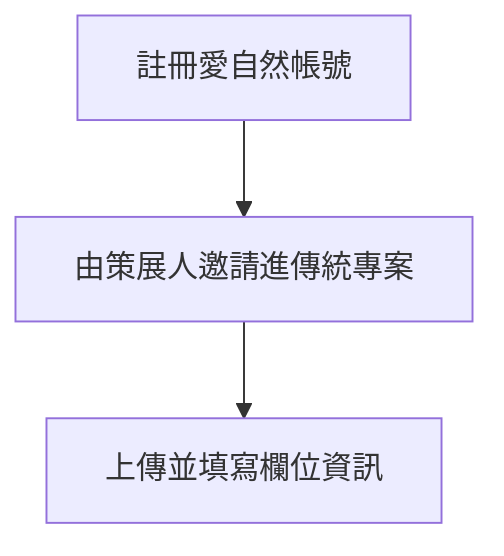

# 二、執行團隊上傳紀錄
###### tags: `inaturalist` `生態給付` `生態給付說明書`

[TOC]

### 1、註冊愛自然帳號
請見上述[教學](/_wcnc1AnSuiCsNq5evIrgA)

### 2、如何上傳影像資料至專案?

在專案管理員將執行團隊成員列為專案負責人(或直接授權使用管理員帳號)後，執行團隊方可上傳觀察記錄。
:::success

:::
:::success

:::

點擊右上帳號資料，下拉式選單選取專案，會出現目前帳號所參與的專案，若要上傳觀察記錄到特定專案，請點擊該專案。
:::success

:::

點擊後可以看到目前專案的紀錄，右上點擊**新增多個觀察記錄到本專案**即可進入上傳介面。
:::success

:::

進入上傳頁面之後(請注意這是**一筆觀察紀錄**)，右方多媒體欄位可以選擇影像檔案及其來源(可以從本機磁碟或google相簿)，也可以依資料儲存型態選擇右上角其他新增資料的方式。
:::success

:::

頁面下方有專案預設的欄位，可針對欄位填寫相關資料。
:::success

:::

若要一次上傳多筆照片，可以選擇右上角**來自照片**，就可以用拖曳或選取的方式將分類好的照片上傳至編輯頁面
:::success

:::
:::success

:::
照片上傳前，會先進入編輯頁面(如下圖)，本頁面要麻煩上傳者先對觀察紀錄進行初步的編輯
:::success

:::

### 3、觀察紀錄的編輯
初步編輯要麻煩觀察者進行以下步驟:
(1) 將相同的觀察紀錄結合成一筆
(2) 輸入相片的位置及日期(可一次大量編輯)
(3) 依照本說明填寫專案欄位
(4) 填寫專案名稱

#### (1) 將相同的觀察紀錄結合成一筆
可以用滑鼠拖曳，將明顯是同一筆觀察紀錄(例如不同角度相同標的)的照片合為同一筆紀錄
:::success

:::

#### (2) 輸入相片的位置及日期(可一次大量編輯)
善用滑鼠拉選，可以一次編輯大批紀錄
:::success

:::

全部選取後，左側詳細資料會顯示選取的觀察數量，可以從下方開始同時編輯
:::success

:::

編輯位置時，可以用上方搜尋列快速查找位置，並善用位置註解與釘選來儲存常用的位置，下一次即可選取釘選的位置而不用輸入。
:::success

:::

另外，大量編輯也可以同時輸入物種，若照片大多屬於植物，可以在左側物種欄位填寫植物，少數動物的觀察記錄在個別調整即可。

輸入最粗略的物種也可以讓更多鑑定者參與鑑定。

#### (3) 依照本說明填寫專案欄位
輸入完詳細資訊後，選擇輸入專案欄位，可以搜尋所屬縣市名字(e.g.花蓮縣、宜蘭縣等)，下拉式選單會輸入欄位選項，即可輸入欄位內容
:::success

:::

以下是目前專案設計給生態服務給付專用的欄位
| 內容 | 名稱 | 資料類型 |
| -------- | -------- | -------- |
| **行政區**     | **鄉鎮區(XX縣)**    | **文字**     |
| **申請人資訊**     | **姓名(XX縣)**   | **文字**     |
| 申請人資訊     | ID(XX縣)    | 文字     |
| **案件地號**     | **地號(XX縣)**    | **文字**     |
| 照片品質     | 照片品質(XX縣)    | 文字     |
| **周次**     | **周次(XX縣)**    | **數值**    |
| 日期     | 日期(XX縣)    | 日期     |
| 備註     | 備註(XX縣)    | 文字     |

現階段(測試第一版)皆沒有對專案欄位進行必填項目的限制，但本團隊希望至少可以填寫(**姓名、地號、周次、鄉鎮區**)四個欄位

申請人姓名上傳時可以在中間打上*號，避免個資洩漏的問題
:::success

:::

填寫完成後如下圖
:::success

:::

#### (4) 填寫專案名稱
最後一個步驟是填寫專案名稱，點擊左側即會出現下拉選單，裡面包含帳號所屬的專案，請選取所屬專案
:::success

:::

完成後即可**提交觀察**
:::success

:::

上傳成功觀察記錄會顯示在專案內容，後續交由鑑定單位進行鑑定即可。
:::success

:::

### APP版本操作
#### 下載APP
愛自然在Android跟iOS系統皆可以下載App進行操作，點選網站連結即可下載
:::success

:::

App下載連結如下:

:::info
[Google play](https://play.google.com/store/apps/details?id=org.inaturalist.android&hl=zh_TW&gl=US)

[Apple app store](https://apps.apple.com/tw/app/inaturalist/id421397028?platform=ipad)
:::

請見上述[教學](/_wcnc1AnSuiCsNq5evIrgA)來完成註冊以及登入

#### 上傳資料
成功登入後首頁會顯示觀察紀錄，點擊右下角的+，即可進入上傳介面
:::success

:::

有數種上傳資料的方式，以目前的需求可選擇右側的選擇圖片，進入手機相簿選擇
:::success

:::

與電腦網頁版一樣，依照觀察紀錄的實際狀況填寫時間與位置資訊，最後記得點選加到專案
:::success

:::
app版會請上傳者直接填寫專案欄位，填寫完成後即可以上傳
:::success

:::

以上是上傳觀察記錄的流程，若實際操作時有問題或建議，可回報在[常見問題](/WPaPxwD5QL2NQw8diofCCQ)內的表單。

