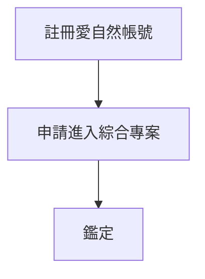

# 三、鑑定單位進行鑑定
###### tags: `inaturalist` `生態給付` `生態給付說明書`

[TOC]

### 1、註冊愛自然帳號
請見上述[教學](/_wcnc1AnSuiCsNq5evIrgA)

### 2、申請進入綜合專案
測試版的綜合專案請點以下連結進入
[重要棲地生態服務給付推動方案](https://www.inaturalist.org/projects/a0ee4f67-783f-44eb-854a-3c82ee0c4b20)

由於綜合專案與傳統專案不同，無法由管理員主動加入成員，需要成員先點擊申請加入(如下圖)，管理員才可以將鑑定者的帳號設為策展人權限。
:::success

:::
勾選**從該專案接收更新**後，點擊**是的，我想加入**即可成為專案人員，可通知專案管理員改變成員的權限
:::success

:::

### 3、開始鑑定
點擊帳號的下拉式選單，點擊**專案**會顯示所有目前加入的專案，選取生態服務給付的專案
:::success

:::
進入專案的首頁後，點擊觀測紀錄，再點擊鑑定，即可開始進行鑑定
:::success

:::
如果想篩選出特定物種進行鑑定(如動物、植物、鳥類)，可藉由點及篩選來進行分類
:::success

:::
由於上傳者可能僅進行界的分類或不分類，鑑定者可以再開始鑑定前將分類位階調製界來進行篩選，或選擇未知，避免漏掉觀察記錄
:::success

:::
鑑定時，可藉由點擊照片來放大細節，進行鑑定時，點擊新增物種鑑定，並且輸入所鑑定的物種名稱(不一定只能填種，屬、亞科、科都是可以填入的分類群)

:::success

:::
若不熟悉或突然忘記物種名詞，也可點擊**建議**，由系統提供建議的物種來協助進行判斷
:::success

:::
若已經有人做出初步鑑定，而您同意該鑑定的話亦可以藉由點選同意來讓觀察提升到研究等級
:::success

:::
當然，不同意他人鑑定的話也可直接輸入您的鑑定，來更改物種。
:::success

:::

如果對於上傳到專案的品質有疑慮，可以再註解下新增欄位**照片品質**，選取**需改善**，協助後臺整理有問題的照片
:::success

:::
或您可以到照片下方的評論區留下評論，與上傳者進行討論釐清問題
:::success

:::

以上是鑑定的流程，若實際操作時有問題或建議，可回報在[常見問題](/WPaPxwD5QL2NQw8diofCCQ)內的表單。
