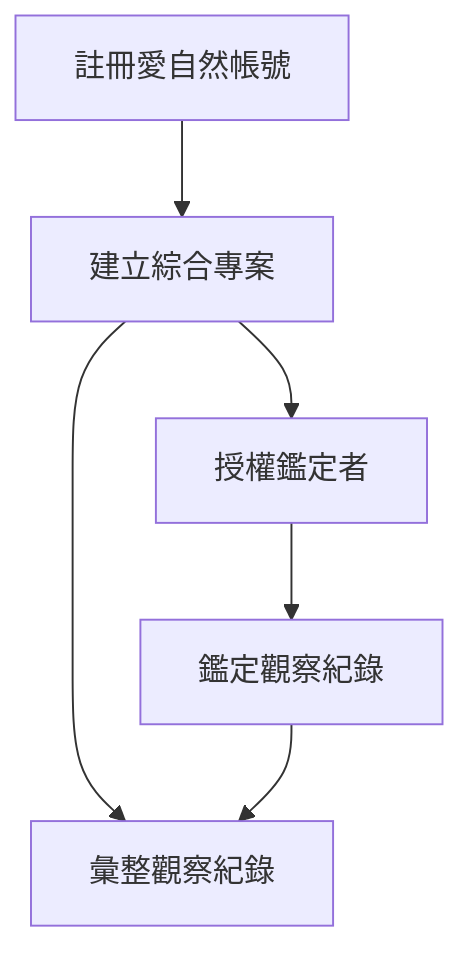

# 四、林務局彙整資料
###### tags: `inaturalist` `生態給付` `生態給付說明書`

[TOC]

### 1、註冊愛自然帳號
請見上述[教學](/_wcnc1AnSuiCsNq5evIrgA)

### 2、建立綜合專案

與傳統專案編輯欄位權限不同，林務局生態服務給付相關業務承辦需求為統整各地方生態服務給付相關上傳資料，因此需要創建**綜合專案**，並將各縣市的傳統專案納入其中

首先進入首頁，**社群**->**專案**->**開啟一個專案**
:::success

:::
選擇綜合專案->入門
:::success

:::
輸入專案名稱、專案摘要等細節
:::success

:::
在觀察需求中輸入專案名稱，可以添加指定的專案
:::success

:::
在其他使用者申請進入專案成員之後，可以授權成員成為專案管理員以獲得更多專案權限
:::success

:::
### 3、彙整及下載觀察記錄
#### 線上檢視
愛自然平台有初步的專案統計資料可以線上檢視，包含物種數及資料品質等，可以從專案上方的欄位點擊檢閱，例如點擊**物種**，會出現專案中層出現的物種(默認以觀察記錄數排名)，點擊物種名上方的**觀察紀錄**，即可呈現原始上傳資料
:::success

:::
原始上傳資料的呈現，可以在點擊進去觀察紀錄，檢視觀察記錄的欄位資料
:::success

:::
:::success

:::

或著在專案首頁點擊右邊閃電形狀的按鈕**統計**，會自動呈現3張圓餅圖，包含觀察紀錄的品質、分類群、專案觀察紀錄的鑑定情況
:::success

:::

#### 匯出資料
在平台上進行線上檢視的資料缺乏篩選的功能，使其進一步分析可能要在匯出後用第三方軟體操作

要匯出並下載專案內所有觀察記錄，可以點擊**觀察記錄**->**匯出觀察**
:::success

:::
進入匯出頁面，依照需求去勾選要匯出的資料(物種分類群、日期範圍等)，如果有使用Excel或google sheet，也可以一次下載所有資料在用第三方軟體去篩選，前提是資料筆數不超過20萬筆
:::success

:::
在建立匯出資料前，記得將專案設定的觀察欄位全部勾選，這些欄位才會出現在匯出資料
:::success

:::
匯出的檔案是CSV檔，可以用自己習慣的文書軟體進行後續處理，下圖是以Excel為例，注意檔案的編碼是Unicode(UTF-8)，有時候出現亂碼時記得改編碼
:::success

:::
預設是以逗點分欄，可以善用軟體的分隔符號分欄
:::success

:::
完成匯出的資料如下圖
:::success

:::

### 4、藉由日誌功能與其他使用者進行宣導事項等
愛自然的專案有日誌功能，可以用類似佈告欄的形式讓所有專案成員看到公布的日誌

在專案首頁點擊**您的成員**旁的齒輪，會跳出懸浮視窗，詢問是否接受專案日誌通知，點選**是**
:::success

:::
點擊**專案日誌**
:::success

:::
會進入發布文章的頁面，點擊**新發佈文章**
:::success

:::
可以按照需求繕寫要發布的公告事項
:::success

:::
成功發表的日誌會出現在專案首頁的最下方
:::success

:::
除此之外，專案成員也會自己的愛自然首頁和註冊時用的電子信箱收到更新的訊息
:::success

:::
要記得提醒成員信箱系統有沒有把愛自然誤視為垃圾訊息
:::success

:::
如果持續沒有收到信件，可以點擊帳號下拉選單->**帳號設定**->**通知**->**開啟電子郵件通知**
:::success

:::

以上是管理及彙整的流程及相關功能，若實際操作時有問題或建議，可回報在[常見問題](/WPaPxwD5QL2NQw8diofCCQ)內的表單。
